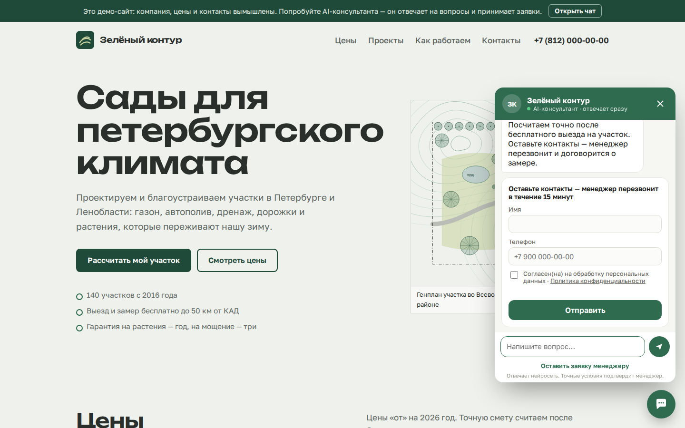
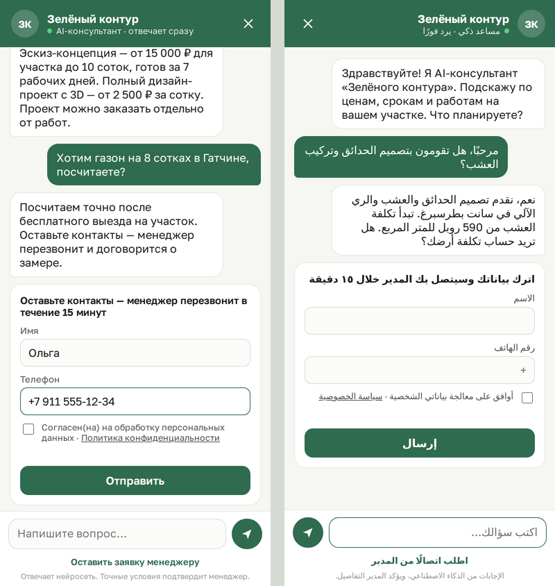

# AI-консультант для сайта · AI chat consultant for websites

🇷🇺 [Русский](#русский) · 🇬🇧 [English](#english)



---

## Русский

Чат на сайте, который круглосуточно отвечает посетителям по информации компании, уточняет задачу и отдаёт менеджеру готовую заявку в Telegram или CRM. Ставится на Tilda и любой сайт одной строкой кода. Один сервер обслуживает сколько угодно сайтов клиентов.

**Что умеет**

- 💬 **Отвечает по базе знаний компании** (YandexGPT): услуги, цены «от», сроки, гарантии. Чего нет в базе — не выдумывает, а предлагает связаться с менеджером.
- 🎯 **Ловит момент заявки.** Когда посетитель просит расчёт, выезд или звонок, в чате появляется короткая форма: имя, телефон, согласие на обработку данных.
- 📨 **Заявка со сводкой** уходит менеджеру в Telegram, MAX и на почту: что нужно, детали, бюджет, сроки и последние вопросы клиента. Параллельно — JSON на вебхук (amoCRM, Bitrix24, n8n, Albato). Каналы независимы: если один недоступен, остальные всё равно доставят заявку.
- ⚙️ **n8n в комплекте:** готовый сценарий — заявка → оценка YandexGPT (горячая / тёплая / холодная и что делать менеджеру) → строка в Google Таблице → срочное сообщение по горячим.
- 🌍 **Русский, английский, арабский** — язык определяется по сообщению, для арабского окно чата зеркалится (RTL).
- 🧩 **Не ломает сайт клиента:** виджет живёт в Shadow DOM, стили сайта на него не влияют и наоборот. Цвет и тексты задаются в настройках, шрифт берётся с сайта.
- 🛡 **Готов к продакшену:** список разрешённых доменов для каждого сайта, лимиты сообщений против накрутки расходов на нейросеть, переписка удаляется через 90 дней (152-ФЗ), данные и модель в России.
- 📊 **Отчёт раз в неделю:** диалоги, заявки, конверсия и с чего начинают разговор.
- 🔁 **Если нейросеть недоступна**, ответ берётся из базы знаний, а форма заявки открывается сразу — заявка не теряется.



### Как подключить нового клиента (≈ 1 час)

1. Скопируйте `sites/zeleny-kontur` в `sites/<id-клиента>` (латиница, цифры, дефис).
2. **`kb.md`** — база знаний: первый абзац о компании, дальше разделы `## Заголовок` с фактами (услуги и цены, сроки, география, оплата, гарантии, частые вопросы).
3. **`site.json`** — название, цвет (`accent`), приветствие, подсказки-кнопки, тексты формы, ссылка на политику конфиденциальности, `qualify` (что узнать до формы), `allowed_origins` (домены сайта клиента), `glossary` (как переводить термины клиента на арабский и английский).
   Куда слать заявки — в **`site.local.json`** рядом (он не попадает в git): `telegram_chat_id`, `max_chat_id` или `max_user_id` (+ `max_token`, если у клиента свой бот в MAX), `lead_emails`, `webhook_url`.
4. Добавьте вашего Telegram-бота в чат менеджеров клиента и узнайте id чата: напишите в чат любое сообщение и откройте `https://api.telegram.org/bot<ТОКЕН>/getUpdates` — нужное поле `chat.id` (у групп начинается с `-100`).
5. Код для сайта: `https://<ваш-сервер>/embed/<id-клиента>` покажет готовую строку:
   ```html
   <script src="https://ai.example.ru/widget.js" data-site="id-клиента" defer></script>
   ```
   **Tilda:** Настройки сайта → Вставка кода → «HTML-код для вставки внутрь head» → сохранить → переопубликовать все страницы ([справка Tilda](https://tilda.cc/ru/answers/a/html-in-head/)).

Перезапуск сервера не нужен: изменения в `kb.md` и `site.json` подхватываются на следующем сообщении.

### Нейросеть: YandexGPT

1. В [консоли Yandex Cloud](https://console.yandex.cloud) создайте платёжный аккаунт (карта РФ) и каталог; скопируйте ID каталога.
2. Создайте сервисный аккаунт с ролью `ai.languageModels.user` и API-ключ для него.
3. В `.env`:
   ```
   LLM_URL=https://ai.api.cloud.yandex.net/v1/chat/completions
   LLM_AUTH=Api-Key <ключ>
   LLM_MODEL=gpt://<id-каталога>/yandexgpt/latest
   LLM_SUMMARY_MODEL=gpt://<id-каталога>/yandexgpt-lite/latest
   LLM_PROJECT=<id-каталога>
   ```
Подойдёт и любой другой OpenAI-совместимый API (GigaChat через совместимый шлюз и т. п.). Сводки для менеджера считает дешёвая Lite-модель.

### Сервер

Любой VPS в России (Timeweb Cloud, Selectel, Yandex Cloud) на Ubuntu с Docker:

```bash
git clone https://github.com/AbdAllAh950/site-ai-consultant.git && cd site-ai-consultant
cp .env.example .env      # ключи, токен бота и DOMAIN
docker compose up -d --build
```

HTTPS выпускается автоматически (Caddy + Let's Encrypt). Нет домена — укажите `DOMAIN=<IP-сервера-через-дефисы>.sslip.io`, например `203-0-113-5.sslip.io`. Демо будет по адресу `https://<домен>/demo/`.

Отчёт для клиента: `docker compose exec app python -m app.report <id-клиента> --send`. Еженедельно — через cron.

**Каналы заявок.** Почта: `SMTP_HOST/PORT/USER/PASSWORD/FROM` в `.env` (Яндекс: `smtp.yandex.ru:465` и пароль приложения) или команда `ai-email-setup` на сервере. MAX: бот создаётся на платформе MAX для партнёров (нужен верифицированный профиль юрлица, ИП или самозанятого), токен — в `MAX_BOT_TOKEN` или `max_token` клиента. Проверить все каналы сайта: `docker compose exec app python -m app.notify test <id-клиента>`.

**n8n** поднимается вместе с сервисом: `https://n8n.<домен>/`. Сценарий `n8n/ai-lead-to-sheet.json` импортируется сам; в нём нужно выбрать доступ к Google (сервисный аккаунт) и включить сценарий. Чтобы заявки шли в n8n, в `site.local.json` укажите `"webhook_url": "http://n8n:5678/webhook/ai-lead"`.

**Автодеплой.** `deploy/bootstrap.sh` один раз включает таймер: сервер каждую минуту проверяет `main` на GitHub и сам пересобирается при изменениях (`sudo ai-deploy` — сразу). Версия видна в `/health`.

### Локальный запуск

```bash
python3 -m venv .venv && source .venv/bin/activate
pip install -r requirements.txt
cp .env.example .env      # без ключа нейросети чат отвечает из базы знаний
uvicorn app.main:app --reload
open http://localhost:8000/demo/
```

### Тесты

```bash
pip install -r requirements.txt playwright && playwright install chromium
pytest -q
```

44 теста. API: база знаний, язык и глоссарий, ответы модели с историей, метка заявки и намерение «перезвоните», падение модели, работа без модели, лимиты, домены, согласие и телефон, доставка в Telegram, MAX, на почту и на вебхук (сводка в ```-блоке), отказ одного канала, приватные настройки сайта, повторная заявка, экранирование HTML, отчёт и удаление старых данных. Браузер (Playwright, реальный сервер): вопрос → ответ → форма → ошибки → заявка → перезагрузка страницы, арабский RTL, полноэкранный чат на телефоне, стили сайта не ломают виджет.

### Структура

```
app/main.py          API: /api/chat, /api/lead, /api/sites/{id}/config, /widget.js, /embed/{id}, /demo
app/consultant.py    промпт, ответы модели, метка заявки, сводка для менеджера
app/knowledge.py     база знаний из Markdown, поиск по разделам
app/store.py         SQLite: переписка, заявки, статистика, удаление старых данных
app/notify.py        Telegram, MAX, почта и вебхук; проверка каналов
n8n/                 сценарии n8n (заявка → YandexGPT → Google Таблица)
deploy/              Caddy, автодеплой с GitHub, настройка ключей и почты на сервере
app/report.py        еженедельный отчёт
widget/widget.js     виджет (без зависимостей, ~22 КБ)
sites/<id>/          настройки и база знаний каждого клиента
demo/                демо-сайт вымышленного ландшафтного бюро
scripts/make_plans.py  генератор иллюстраций-генпланов для демо
```

---

## English

An AI chat for business websites: it answers visitors 24/7 from the company's own knowledge base (YandexGPT, no invented prices), notices when someone wants a quote, a site visit or a call, collects name, phone and consent right in the chat, and sends the manager a summarized lead in Telegram, MAX and email, plus a JSON webhook for any CRM. A bundled n8n workflow scores each lead with YandexGPT and appends it to a Google Sheet. It installs on Tilda or any site with one `<script>` tag, and one server hosts many client sites.

It speaks Russian, English and Arabic: the language is detected per message and the window mirrors for RTL. The widget is a dependency-free Shadow DOM component, so the host page's CSS can't break it. Each site has its own allowed domains. There are per-visitor and per-session limits on model spend, a 90-day retention purge, and Russian hosting for 152-FZ. If the model is down, the chat falls back to the knowledge base and shows the lead form, so no lead is lost. A weekly report goes to the client's Telegram.

**Run:** `pip install -r requirements.txt && uvicorn app.main:app` → `http://localhost:8000/demo/`. **Deploy:** `docker compose up -d --build` (Caddy issues HTTPS automatically). **Tests:** `pytest -q`: 36 tests, including Playwright end-to-end runs against the real server.

The demo company "Zeleny Kontur" (a landscape studio), its prices and contacts are fictional.

---

Автор / Author: Abdallah Essa · MSc Big Data & ML, ITMO · [GitHub](https://github.com/AbdAllAh950)
